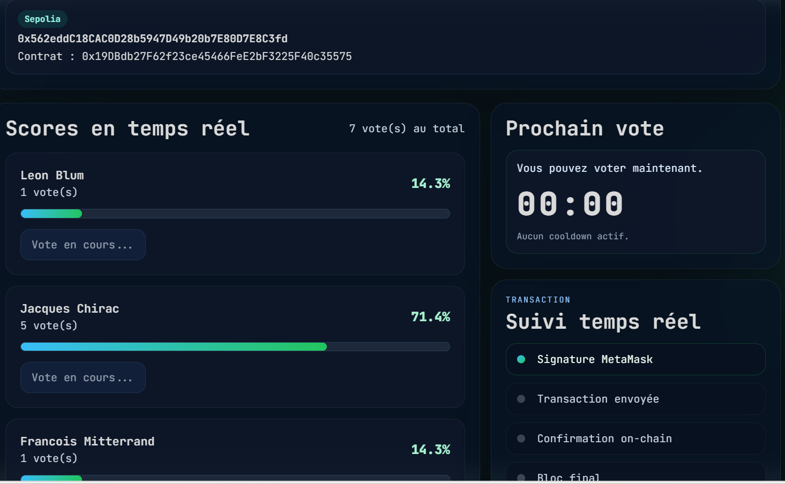
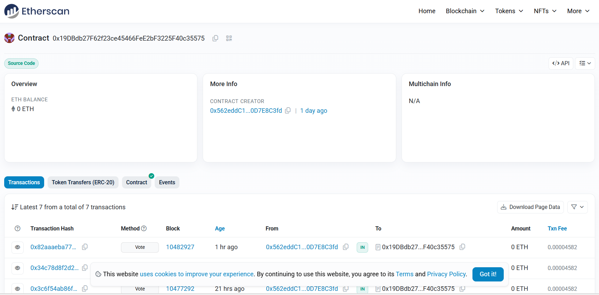
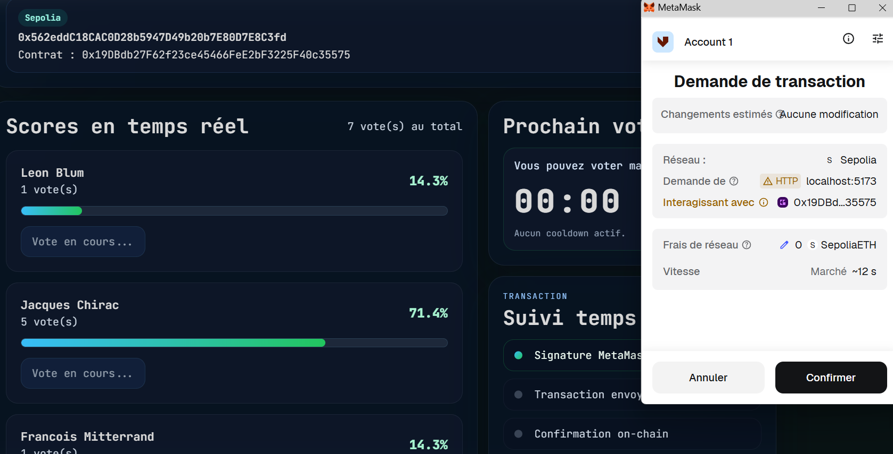
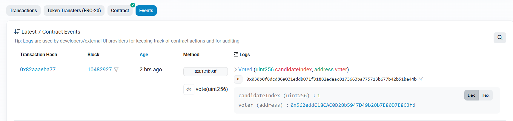
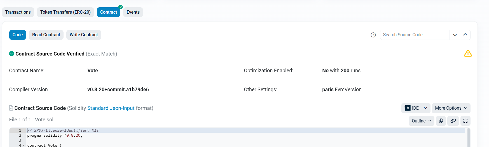
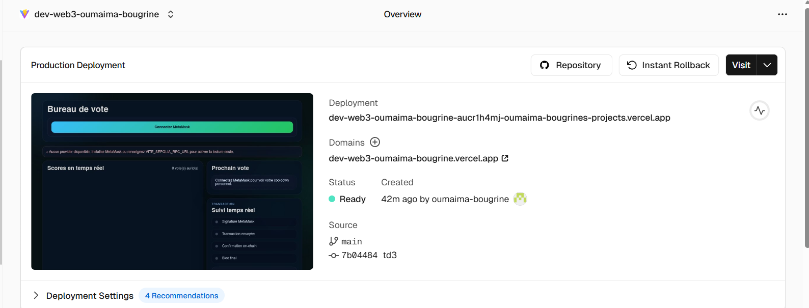

# TD3 Smart Contract + Frontend (React)

## 🧑‍💻 Auteurs / Noms
- Étudiants : Oumaima Bougrine Benjamin Carteron

🧠 Concepts Théoriques Appliqués
Ce projet met en œuvre les piliers de la technologie blockchain étudiés en cours :

- L'immuabilité : Une fois le contrat déployé sur Sepolia, son code est figé. Les votes enregistrés sont protégés par le hachage cryptographique des blocs.

- La Décentralisation : L'application ne repose pas sur un serveur centralisé (Node/Express/SQL), mais sur l'EVM (Ethereum Virtual Machine). La logique métier est distribuée sur tous les nœuds du réseau.

- Transparence et Auditabilité : Chaque interaction est traçable sur l'explorateur de blocs Etherscan, garantissant qu'aucun vote ne peut être falsifié.

Projet: vote décentralisé (Bloc 4 - B3). Cette branche contient:
- `mon-contrat/` : Hardhat + contrat Solidity `Vote.sol` + déploiement + config réseau
- `front_td3/` : application React + Ethers.js (lectures + vote + événements)
- adresse du contrat Sepolia : `0x19DBdb27F62f23ce45466FeE2bF3225F40c35575`
- Lien Etherscan : https://sepolia.etherscan.io/address/0x19DBdb27F62f23ce45466FeE2bF3225F40c35575
- L'URL de l'App déployée sur Vercel : https://dev-web3-oumaima-bougrine.vercel.app

## ✅ Ce que tu as construit

### Contrat Solidity (`mon-contrat/contracts/Vote.sol`)
- Contrat `Vote` avec:
  - tableau `string[] public candidates`
  - mapping `votes` (uint256 => uint256) public votes
  - event `Voted(uint256 candidateIndex, address voter)`
  - constructor: initialise 3 candidats (`Leon Blum`, `Jacques Chirac`, `Francois Mitterrand`)
- fonctions implémentées :
  - `function getVotes(uint256 _candidateIndex) public view returns (uint256)`
  - `function getCandidatesCount() public view returns (uint256)`
  - `function vote(uint256 _candidateIndex) public`
  - `require(_candidateIndex < candidates.length, "Candidat invalide")` dans `vote`
- event déclenché dans `vote()` pour traçabilité on-chain
- pas de cooldown on-chain dans ce contrat (cooldown côté frontend local via `localStorage` seulement)

### Hardhat config (`mon-contrat/hardhat.config.cjs`)
- solidity 0.8.20
- réseau Sepolia via Alchemy
- clé privée en `.env` (processus: `SEPOLIA_PRIVATE_KEY`, `ALCHEMY_API_KEY`)
- plugin etherscan pour vérif sur Etherscan

### script de déploiement (`mon-contrat/scripts/deploy.js`)
- factory `Vote` deploy
- output adresse contract
- attente `waitForDeployment()`

### tests (présents) dans `mon-contrat/test/vote-test.js`
- test de base sur le contrat (à vérifier si déjà écrit dans ton projet); si absent, ajouter vérifier vos entrées `vote` et `getVotes`

---

## 🔧 Frontend React (dans `front_td3/`)

🔌 Architecture de Communication
Pour faire le pont entre le Web2 (React) et le Web3 (Ethereum), nous utilisons Ethers.js avec deux modes distincts :

- Le Provider (Lecture seule) : Connecté via un nœud RPC Alchemy. Il permet de récupérer instantanément le nom des candidats et le nombre de voix dès le chargement de la page, sans solliciter MetaMask.

- Le Signer (Écriture) : Lorsque l'utilisateur clique sur "Voter", MetaMask intervient pour signer la transaction. Ce processus garantit la sécurité : la dApp ne manipule jamais la clé privée de l'utilisateur.

- L'ABI (Le dictionnaire) : Le fichier abi.json est crucial. Il permet à Ethers.js de traduire nos commandes JavaScript en instructions compréhensibles par le contrat Solidity (Bytecode).


### `src/config.js`
- `CONTRACT_ADDRESS` = `0x19DBdb27F62f23ce45466FeE2bF3225F40c35575`
- `EXPECTED_CHAIN_ID` = 11155111 (Sepolia)
- `EXPECTED_NETWORK_NAME` = "Sepolia"
- `EXPLORER_BASE_URL` = "https://sepolia.etherscan.io"

### `src/abi.json`
- ABI du contrat `Vote`, incluant `constructor`, `Voted`, `candidates`, `getCandidatesCount`, `getVotes`, `vote`, `votes`

### `src/App.jsx`
- connexion provider:
  - priorité MetaMask (`BrowserProvider`) quand MetaMask sur le bon réseau
  - sinon lecture seule sur RPC Sepolia (`VITE_SEPOLIA_RPC_URL` via `JsonRpcProvider`)
- lecture des candidats + votes:
  - `getCandidatesCount()` puis `candidates(i)` et `getVotes(i)`
- vote transaction:
  - `vote(candidateIndex)` via contrat écrit avec signer (MetaMask)
  - `tx.wait()` + rechargement des données
- cooldown prosp, côté client + tentative on-chain (fonction `getTimeUntilNextVote` si présente)
- écoute d’événement `Voted` pour mise à jour live / historique
- gestion d’état UI:
  - `account`, `balance`, `candidates`, `info`, `error`, `txState`, `lastEvent`, etc.

---

## 🚀 Flux normal 

1. `mon-contrat`:
   - `npm install`
   - `.env` avec clés (private + alchemy)
   - `npx hardhat compile`
   - `npx hardhat run scripts/deploy.js --network sepolia`
   - noter l’adresse de contrat
2. générer l’ABI (`mon-contrat/artifacts/contracts/Vote.sol/Vote.json`) -> `front_td3/src/abi.json`
3. mettre l’adresse dans `front_td3/src/config.js`
4. `cd front_td3`
   - `npm install`
   - `npm run dev`
5. ouvrir `localhost:5173`, sélectionner Sepolia dans MetaMask, tester le vote

---

## 🧩 Correspondance frontend ↔ contrat

- `getCandidatesCount()` -> nombre de candidats
- `candidates(i)` -> nom du candidat
- `getVotes(i)` -> nombre de voix
- `vote(i)` -> envoi d’un vote
- `Voted` event -> historique / UI en temps réel

---

## 💡 Points à vérifier et amélioration

- Séparer réseau local (Ganache 1337) / network public (Sepolia 11155111)
- Ajouter / compléter tests unitaires Hardhat
- Versionner `abi.json` après chaque changement de contrat
- Si tu veux un contrat plus riche: cooldown on-chain (`mapping(address=>uint256); getTimeUntilNextVote();`), whitelist, double-vote interdit…

---

## 📁 Arborescence clé

```
mon-contrat/
  contracts/Vote.sol
  scripts/deploy.js
  test/vote-test.js
  hardhat.config.cjs
  .env (private+alchemy keys, ignoré par git)
  package.json
  node_modules/

front_td3/
  src/App.jsx
  src/config.js
  src/abi.json
  src/main.jsx
  package.json
  vite.config.js
  node_modules/
```

---

## �️ Guide de démarrage rapide
Pour tester ou déployer le projet localement, suivez ces étapes :

1. Configuration du Smart Contract (mon-contrat/)

```bash
# Se placer dans le dossier
cd mon-contrat

# Installer les dépendances (Hardhat, Ethers, Dotenv)
npm install

# Compiler le contrat Solidity
npx hardhat compile

# Lancer les tests unitaires
npx hardhat test

# Déployer sur Sepolia (nécessite un fichier .env configuré)
npx hardhat run scripts/deploy.js --network sepolia

# Vérifier le contrat sur Etherscan
npx hardhat verify --network sepolia 0x19DBdb27F62f23ce45466FeE2bF3225F40c35575
```

2. Configuration du Frontend (front_td3/)

```bash
# Se placer dans le dossier
cd ../front_td3

# Installer les dépendances (React, Ethers, Vite)
npm install

# Lancer l'application en mode développement
npm run dev

# Générer le build de production
npm run build
```

---

## �📌 Résultat du TD

- Contrat Solidity déployé sur Sepolia
- API contract accessible via `CONTRACT_ADDRESS`
- Frontend React fonctionnel connecté en lecture et écriture
- Événements on-chain tracés (`Voted`)
- `require()` valide les conditions (candidat invalide)

---

🛠️ Défis techniques et Résolution
Durant le développement, plusieurs obstacles ont été surmontés :

- Gestion de l'asynchronisme : Contrairement à une base de données classique, une transaction blockchain prend du temps à être minée. J'ai utilisé `tx.wait()` pour bloquer l'UI et informer l'utilisateur pendant la confirmation du bloc.

- Mise à jour temps réel : Pour éviter que l'utilisateur doive rafraîchir la page, j'ai mis en place un "Listener" sur l'événement Solidity `Voted`. Dès que la blockchain confirme un vote, l'interface React se met à jour automatiquement.

- Compatibilité de l'ABI : Le passage du format de sortie Hardhat (objet complexe) au format attendu par Ethers.js (tableau simple) a nécessité une attention particulière sur la structure du fichier `abi.json`.

---

## 📸 Preuves de fonctionnement (Démonstration)

Cette section présente les preuves visuelles de l'intégration réussie entre le contrat Solidity et l'interface React, conformément aux objectifs du TD.

### 1. Interface Utilisateur et Connexion Web3

*Figure 1 : Capture de l'application en cours d'exécution sur localhost. On observe que l'adresse du wallet (0x562e...) est correctement récupérée via le Signer de MetaMask. Les données des candidats (noms et scores) sont lues en temps réel depuis le contrat Sepolia.*

### 2. Validation du Déploiement (Etherscan)

*Figure 2 : Consultation du contrat sur Sepolia Etherscan. Cette capture confirme la création du contrat et l'historique des premières transactions. C'est la preuve de l'immuabilité et de la transparence du système.*


### 3. Signature et Sécurité via MetaMask

*Figure 3 : Fenêtre de confirmation MetaMask déclenchée lors d'un vote. On y voit l'estimation des frais de Gas et l'appel à la fonction `vote`. Cela illustre la séparation entre la dApp (qui prépare la transaction) et le Wallet (qui la signe).*

### 4. Traçabilité des Événements (Logs)

*Figure 4 : Détail de l'événement "Voted" décodé sur la blockchain. L'utilisation des Events Solidity permet au frontend d'écouter les changements d'état sans avoir à interroger le réseau en boucle (polling), optimisant ainsi les performances.*

### 💎 Vérification du Smart Contract
Le code source du contrat a été vérifié sur Etherscan. Cette étape garantit que le bytecode déployé correspond exactement au code Solidity fourni, permettant une auditabilité complète par les tiers.


*Figure 6 : Statut "Contract Source Code Verified". On y voit la version du compilateur (0.8.20) et le code source complet accessible publiquement.*

## 🚀 Déploiement en Production

Le projet est entièrement déployé et accessible en ligne. L'interface frontend est hébergée sur **Vercel** et communique avec le Smart Contract via le réseau de test **Sepolia**.

🔗 **Lien de la dApp :** [https://dev-web3-oumaima-bougrine.vercel.app](https://dev-web3-oumaima-bougrine.vercel.app)

### Aperçu du déploiement Vercel

*Figure 5 : Statut du déploiement sur Vercel. Le projet est configuré en mode "Production" avec un pipeline de déploiement continu lié au dépôt GitHub.*